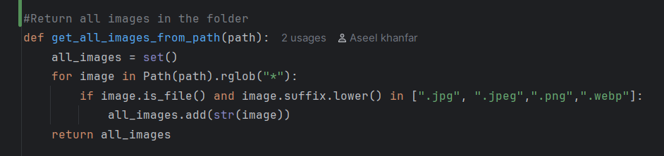
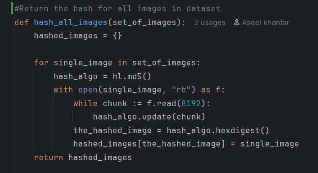
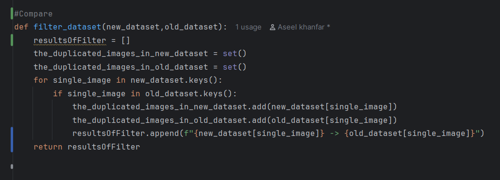
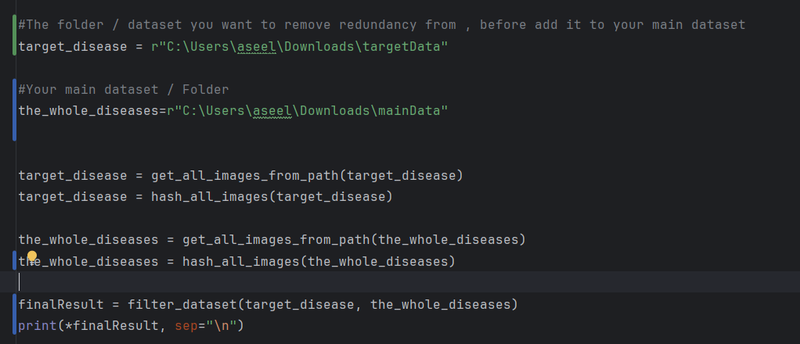
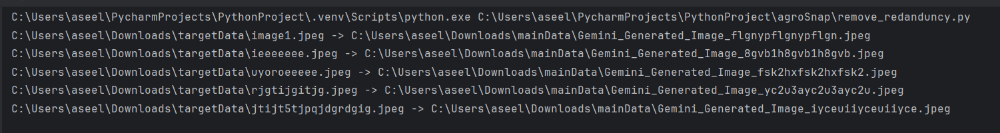

# 🌿 Plant Disease Detection: Model Training & Dataset 


## Welcome! This repository is dedicated entirely to the machine learning pipeline of our project. Here, you will find everything related to the **data preparation**, **model architecture**, and the **training process**.

**⚠️NOTE: If you are looking for the main web application and user interface, please visit our [Main Project Repository](https://github.com/Agrosnap-Team/agrosnap-app).**

## 📁 Files
 **``model-train-code``** : These codes has the details of uploading dataset , model structure and levels of training [ warmup - fine-tunning ]
     
 **``convertModel.ipynb``** : This file contains the codes of transferring ``model.keras`` to ``model.json`` , this step to integrate the model in the browser.
      
**``Dataset``** : https://drive.google.com/file/d/1fCihcbZTQzWQhjz6U051XK95qwFhauiU/view?usp=sharing.    
    
**``The model [ keras ]``** : https://drive.google.com/file/d/1pF78LQTC3DDR44SHbJPhoz_mR0UrDcIK/view?usp=drive_link   
    
**``remove_redanduncy``** : Python script for checking the duplication in ``2 datasets`` or ``2 folders``

**⚠️NOTE : Due to cannot upload the large files , so you can reach the ``dataset`` and ``keras model`` by ``google drive links``** 
     
## 💻 Important Code Implementation    
### 1- remove_redanduncy   
### 📁 Get Images
    
The ```get_all_images_from_path()``` returns all images in folders and sub-folders  
<br/>
<br/>
###  Hash All Images
    
The `hash_all_images()` function generates an MD5 hash for each image in the dataset.

Each image is opened in binary mode and read in chunks of 8192 bytes. The content of each image is then used to generate a unique hash value.

The function stores the results as a dictionary where:

- The **key** is the image's MD5 hash.
- The **value** is the image's file path.

This allows images from different datasets to be compared efficiently. If two images have the same MD5 hash, their file contents are identical.

```python
{
    "image_hash": "path/to/image.jpg"
}
```
<br/>
<br/>

###  Compare the target dataset with the main dataset
     


The `filter_dataset()` function compares the MD5 hashes of the target dataset with the hashes of the main dataset.

For each image in the target dataset, the function checks whether its hash already exists in the main dataset.

If a matching hash is found, the image is considered an identical duplicate.

The function then records the paths of both images in the following format:

```text
target_dataset/image.jpg -> main_dataset/image.jpg
```
<br/>
<br/>

### ⁉️ How to Use      

       

Before running the script, specify the paths to the two datasets:

- **Target dataset:** the dataset you want to check for duplicate images before adding it to your main dataset.
- **Main dataset:** the dataset that already contains your existing images.

```python
# The dataset you want to check for duplicates
target_disease = r"C:\Users\aseel\Downloads\targetData"

# Your existing/main dataset
the_whole_diseases = r"C:\Users\aseel\Downloads\mainData"
```
<br/>
<br/>

###  Results    
     
After running the script, duplicate images are reported by showing the path of the image in the target dataset and the path of its identical copy in the main dataset.


